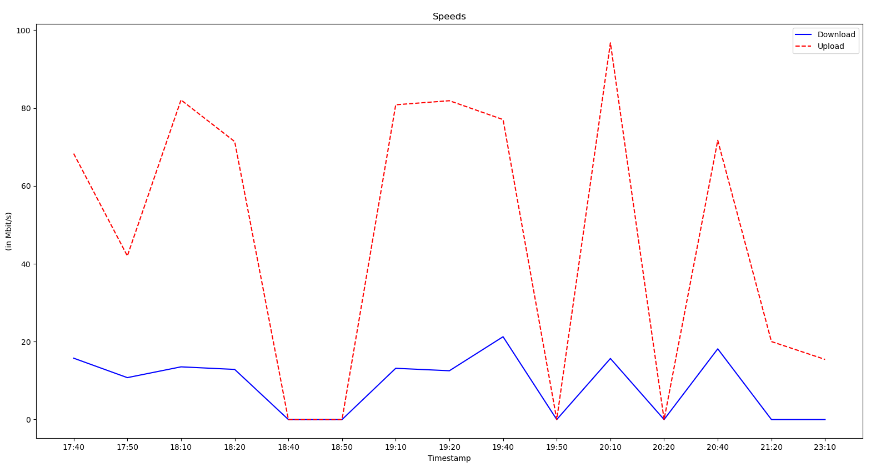

## **Installation**
- #### **Download the whole repo as a folder**
- #### **make the install.sh script executable**(`chmod +x install.sh`)
- #### **run the `install.sh` script** (_Note:You need to have admin privileges to do this_)

## **Graphing Wi-Fi speeds**
- #### **To plot the speeds for today type `plotSpeed` into your terminal**
 
 

 

## **Pausing**
- #### **To pause the speed data collection type `NSpause` into your terminal** (_Note:You need to have admin privileges to do this_)
- #### **To resume speed data collection run the `install.sh` script**

 

## **Uninstall**
- #### **run the `uninstall.sh` script** (_Note:You need to have admin privileges to do this_)
- #### **then remove the directory**

 

***

### **Dependencies**
- ##### **python3**(_install using your distro's package manager_)
    - ##### **matplotlib**(_install using pip_)
    - ##### **sqlite3**(_install using pip_)
- ##### **speedtest-cli**(_install using your distro's package manager_)

_Note : This software will only collect wifi speed data when the machine is NOT on suspend_

_Note : If NSpause and plotSpeed arent working run `source ~/.bashrc`_
